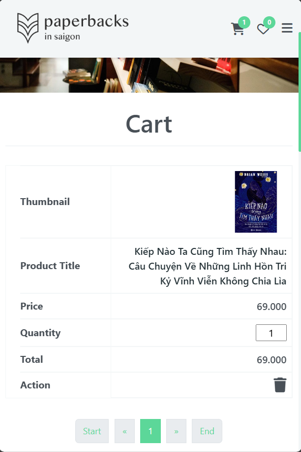

# Book Store - Trang web mua bán sách

## Giới thiệu

Book Store là một trang web mua bán sách trực tuyến với giao diện thân thiện, dễ sử dụng. Dự án được phát triển với các công nghệ hiện đại cho cả phía client và server, đồng thời được đóng gói bằng Docker để dễ dàng triển khai.

## Công nghệ sử dụng

### Frontend

- [x] JavaScript
- [x] Bootstrap
- [x] CSS
- [x] Webpack (Webpack-cli, webpack-dev-server)

### Backend

- [x] Express.js (Node.js framework)
- [x] lowdb (JSON database)
- [x] fuse.js (Lightweight fuzzy-search library)

### DevOps

- [x] Docker
- [x] Docker Compose

### Testing

- [x] Postman (API testing)

## Cấu trúc dự án

```bash
├── admin/ # Frontend (Admin) - JS + Bootstrap + Webpack
│ ├── assets/
│ ├── css/
│ ├── js/
│ ├── db.json
│ ├── Dockerfile
│ ├── index.html
│ ├── package.json
│ └── webpack.config.js
│
├── client/ # Frontend (User) - JS + Bootstrap + Webpack
│ ├── assets/
│ ├── pages/
│ ├── src/
│ ├── Dockerfile
│ ├── index.html
│ ├── main.css
│ └── webpack.config.js
│
├── server/ # Backend API
│ ├── controllers/
│ ├── middlewares/
│ ├── modules/
│ ├── appRoute.js
│ ├── index.js
│ ├── db.json # LowDB database
│ ├── Dockerfile
│ └── .env
│
├── docker-compose.yml # Cấu hình toàn bộ hệ thống
└── README.md
```

## Giao diện

### PC

<div style="display: flex; align-item: center; gap: 10px; justify-content: space-between;">
    
    
    
    
    
    
    
    
</div>

_Hình ảnh: Trang thông tin sản phẩm trên PC_

### Tablet

<div style="display: flex; align-item: center; gap: 10px; justify-content: space-between;">
    
    
    
    
    
    
    
    
</div>

_Hình ảnh: Trang thông tin sản phẩm trên Tablet_

### Mobile

<div style="display: flex; align-item: center; gap: 10px; justify-content: space-between;">
    
    
    
    
    
    
    
    
</div>

_Hình ảnh: Trang thông tin sản phẩm trên thiết bị di động_

## Yêu cầu hệ thống

Để chạy dự án này, bạn cần cài đặt:

- [Node.js](https://nodejs.org/) (v18.x hoặc cao hơn)
- [Docker](https://www.docker.com/get-started)
- [Docker Compose](https://docs.docker.com/compose/install/)
- [Yarn](https://yarnpkg.com/getting-started/install)

## Hướng dẫn cài đặt

### 1. Clone dự án

```bash
git clone <your-repo-url>
cd <tên-thư-mục-dự-án>
```

### 2. Build Container

```bash
docker compose build --no-cache
```

# 3. Chạy ứng dụng

```bash
docker compose up
```

# 4. Truy cập các dịch vụ

- Client: http://localhost:5173
- Admin: http://localhost:5174
- Server API: http://localhost:3000/api

# 5. Để dừng chương trình

- Nhấn Ctrl+C
